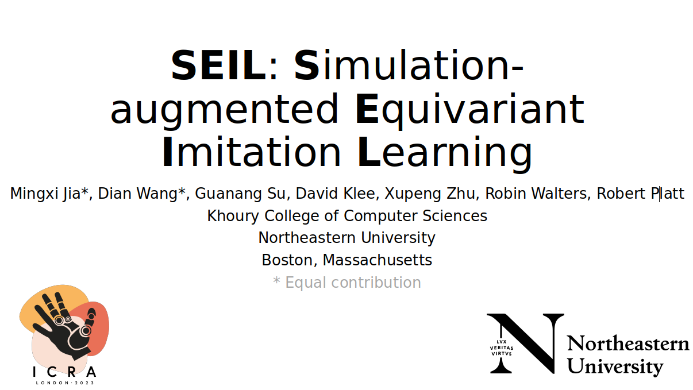

# ICRA2023 SEIL: Simulation-augmented Equivariant Imitation Learning
 

## Instruction
1. Clone this repo
```
git clone https://github.com/SaulBatman/SEIL.git
cd SEIL & pip install -r requirements.txt
```
2. Clone environment repo and export PYTHONPATH
```
git clone https://github.com/SaulBatman/BulletArm.git -b SEIL
export PYTHONPATH=$PYTHONPATH:/YOURPATH/BulletArm/
```
3. Run simulation experiments in Block in Bowl
```
cd SEIL/scripts
# run SEIL
python main.py --env=close_loop_block_in_bowl --model=equi_d
# run CNN baseline
python main.py --env=close_loop_block_in_bowl --model=cnn
# run implicit BC baseline
python main.py --env=close_loop_block_in_bowl --model=ibc
```
4. Run real-world experiments in Block in Bowl after unzip data into /scripts/buffer(dataset link)
```
cd SEIL/scripts
# run SEIL
python main.py --env=real_close_loop_block_in_bowl --model=equi_d --load_buffer=/YOURPATH/SEIL/scripts/buffer/bowl_new10.npy
# run CNN baseline
python main.py --env=real_close_loop_block_in_bowl --model=cnn --load_buffer=/YOURPATH/SEIL/scripts/buffer/bowl_new10.npy
# run implicit BC baseline
python main.py --env=real_close_loop_block_in_bowl --model=ibc --load_buffer=/YOURPATH/SEIL/scripts/buffer/bowl_new10.npy
```
# Note
* All saved models and parameters are defaultly saved in YOURPATH/SEIL/scripts/outputs
* There are other choices of environments (replace --env=close_loop_block_in_bowl):
  ```
  --env=close_loop_block_stacking
  --env=close_loop_shoe_packing
  --env=close_loop_drawer_opening
  ```
* You can select number of demonstrations by adding the following argument (DEFAULT=10):
  ```
  --planner_episode=INT_NUM
  ```
* To visualize a real-time pybullet renderer by adding the following argument:
  ```
  --render=t
  ```
